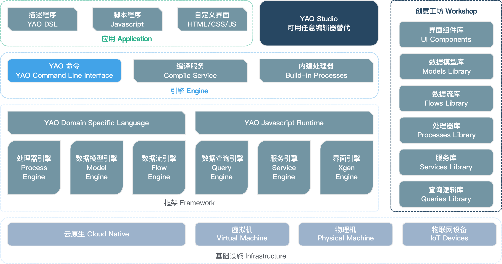

# yao 框架

## 新建应用
```bash

```
## 文件处理器
```
var fs = new FS("dsl");
var fs = new FS("script");
var fs = new FS("system");

```
## 更新模型
```bash
# admin/user.mod.yao
yao migrate -n admin.user
```
## 使用处理器
```javascript
yao run models.product.Paginate '::{}' 1 2
script 原函数 studio 
```
## 处理器列表
```js
function ReadFile() {
  let fs = new FS("script");
  let data = fs.ReadFile("/f1.js"); // /data/app/scripts/f1.js
  return data;
}

function WriteFile() {
  let fs = new FS("script");
  let script = `
    function Foo() {
      return "Bar"
    }
  `;
  let length = fs.WriteFile("/models/f2.js", script, 0644); // /data/app/scripts/f2.js
  return length;
}

## http 处理

https://yaoapps.com/doc/%E6%89%8B%E5%86%8C/%E5%A4%84%E7%90%86%E5%99%A8/HTTP

- http.delete,参数：`[<URL>, <Payload (可选)>, <Query(可选)>, <Headers (可选)>]`
- http.get,参数：`[<URL>, <Query (可选)>, <Headers (可选)>]`
- http.head,参数：`[<URL>, <Payload (可选)>, <Query (可选)>, <Headers (可选)>]`
- http.patch,参数：`[<URL>, <Payload (可选)>, <Query(可选)>, <Headers (可选)>]`
- http.post,参数:`[<URL>, <Payload (可选)>, <Files (可选)>, <Query(可选)>, <Headers (可选)>]`
- http.put,参数：`[<URL>, <Payload (可选)>, <Query(可选)>, <Headers (可选)>]`
- http.send,参数：`[<METHOD>, <URL>, <Payload (可选)>,<Query (可选)>, <Headers (可选)>,<Files(可选)>]`
- http.stream,参数：`[<METHOD>, <URL>, <Handler procsss name>,<Payload (可选)>, <Query (可选)>, <Headers (可选)>]`

## 模型相关

操作模型，相当于操作表数据，需要有 model id。

- models.\<MODEL_ID\>.create
- models.\<MODEL_ID\>.delete
- models.\<MODEL_ID\>.deletewhere
- models.\<MODEL_ID\>.destroy
- models.\<MODEL_ID\>.destroywhere
- models.\<MODEL_ID\>.insert,批量一次性保存
- models.\<MODEL_ID\>.eachsave,批量逐条保存
- models.\<MODEL_ID\>.eachsaveafterdelete
- models.\<MODEL_ID\>.find
- models.\<MODEL_ID\>.get
- models.\<MODEL_ID\>.paginate
- models.\<MODEL_ID\>.save
- models.\<MODEL_ID\>.selectoption
- models.\<MODEL_ID\>.update
- models.\<MODEL_ID\>.updatewhere

- models.\<MODEL_ID\>.load
- models.\<MODEL_ID\>.migrate

## openai 相关

- openai.audio.transcriptions
- openai.chat.completions
- openai.embeddings
- openai.tiktoken

## 计划

- schedules.\<ID\>.start
- schedules.\<ID\>.stop

## 数据库表处理

SCHEMA_ID 默认是 default，比如获取所有的表名处理器`schemas.default.tables`

- schemas.\<SCHEMA_ID\>.columnadd
- schemas.\<SCHEMA_ID\>.columnalt
- schemas.\<SCHEMA_ID\>.columndel
- schemas.\<SCHEMA_ID\>.create
- schemas.\<SCHEMA_ID\>.drop
- schemas.\<SCHEMA_ID\>.indexadd
- schemas.\<SCHEMA_ID\>.indexdel
- schemas.\<SCHEMA_ID\>.tablecreate
- schemas.\<SCHEMA_ID\>.tablediff
- schemas.\<SCHEMA_ID\>.tabledrop
- schemas.\<SCHEMA_ID\>.tableexists
- schemas.\<SCHEMA_ID\>.tableget
- schemas.\<SCHEMA_ID\>.tablerename
- schemas.\<SCHEMA_ID\>.tables
- schemas.\<SCHEMA_ID\>.tablesave

## 会话处理

在 api 主动中有经过用户验证的处理后才会有会话信息

- session.dump
- session.get
- session.id
- session.set
- session.setmany

- ssl.sign
- ssl.verify

## 存储

- stores.\<ID\>.clear
- stores.\<ID\>.del
- stores.\<ID\>.get
- stores.\<ID\>.getdel
- stores.\<ID\>.has
- stores.\<ID\>.keys
- stores.\<ID\>.len
- stores.\<ID\>.set

## 任务

- tasks.\<TASK_ID\>.add
- tasks.\<TASK_ID\>.get
- tasks.\<TASK_ID\>.progress

## 工具类

- utils.app.inspect
- utils.app.ping

### 数组操作

- utils.arr.column
- utils.arr.get
- utils.arr.indexes
- utils.arr.keep
- utils.arr.mapset
- utils.arr.pluck
- utils.arr.split
- utils.arr.tree
- utils.arr.unique

兼容旧版本

- xiang.helper.arraycolumn
- xiang.helper.arrayget
- xiang.helper.arrayindexes
- xiang.helper.arraykeep
- xiang.helper.arraymapset
- xiang.helper.arraypluck
- xiang.helper.arraysplit
- xiang.helper.arraytree
- xiang.helper.arrayunique

### 验证码

- utils.captcha.make
- utils.captcha.verify

### 环境变量

- utils.env.get
- utils.env.getmany
- utils.env.setmany

### 流程控制

- utils.flow.case
- utils.flow.each
- utils.flow.for
- utils.flow.if
- utils.flow.return
- utils.flow.throw

- utils.fmt.print

### jwt

- utils.jwt.make
- utils.jwt.verify

### 对象操作

- utils.map.array
- utils.map.del
- utils.map.delmany
- utils.map.get
- utils.map.keys
- utils.map.set
- utils.map.values
- utils.tree.flatten

兼容旧版本

- xiang.helper.mapdel
- xiang.helper.mapget
- xiang.helper.mapkeys
- xiang.helper.mapmultidel
- xiang.helper.mapset
- xiang.helper.maptoarray
- xiang.helper.mapvalues

### 时间日期

- utils.now.date
- utils.now.datetime
- utils.now.time
- utils.now.timestamp
- utils.now.timestampms
- utils.time.sleep

### 密码

- utils.pwd.verify

### 字符串

- utils.str.concat
- utils.str.hex
- utils.str.join
- utils.str.joinpath
- utils.str.uuid

## widget 处理

操作 widgets,读取所有已加载的 widget 的属性列表，包含自定义的 widget。

- widget.actions
- widget.apis
- widget.fields
- widget.filters
- widget.models

## 操作自定义 widget

处理器：widget.remove，删除 widget 源代码，处理参数：

- name,widget 配置名称，比如 dyform/iform
- file,widget 实例名称[文件名称],比如 feedback/website

处理器：widget.save，保存 widget 源代码，处理参数：

- name,widget 配置名称，比如 dyform/iform
- file,widget 实例名称[文件名称],比如 feedback/website
- source,源代码

## 旧版兼容

- xiang.env.get
- xiang.env.multiget
- xiang.env.multiset
- xiang.env.set
- xiang.flow.case
- xiang.flow.each
- xiang.flow.for
- xiang.flow.if
- xiang.flow.return
- xiang.flow.sleep
- xiang.flow.throw
- xiang.helper.captcha
- xiang.helper.captchavalidate
- xiang.helper.case
- xiang.helper.each
- xiang.helper.envget
- xiang.helper.envmultiget
- xiang.helper.envmultiset
- xiang.helper.envset
- xiang.helper.for
- xiang.helper.hextostring
- xiang.helper.if
- xiang.helper.jwtmake
- xiang.helper.jwtvalidate

- xiang.helper.passwordvalidate
- xiang.helper.print
- xiang.helper.return
- xiang.helper.strconcat
- xiang.helper.throw
- xiang.import.data
- xiang.import.datasetting
- xiang.import.mapping
- xiang.import.mappingsetting
- xiang.import.run
- xiang.import.setting
- xiang.main.appfilecontent
- xiang.main.favicon
- xiang.main.filecontent
- xiang.main.inspect
- xiang.main.ping
- xiang.sys.inspect
- xiang.sys.ping
- xiang.sys.print
- xiang.sys.sleep

## yao 相关

- yao.app.check
- yao.app.icons
- yao.app.menu
- yao.app.service
- yao.app.setting
- yao.app.setup
- yao.app.xgen
- yao.chart.component
- yao.chart.data
- yao.chart.setting
- yao.chart.xgen
- yao.component.selectoptions
- yao.crypto.hash
- yao.crypto.hmac
- yao.crypto.weworkdecrypt
- yao.dashboard.component
- yao.dashboard.data
- yao.dashboard.setting
- yao.dashboard.xgen
- yao.env.get
- yao.env.multiget
- yao.env.multiset
- yao.env.set
- yao.expression.selectoption
- yao.expression.trimspace
- yao.form.component
- yao.form.create
- yao.form.delete
- yao.form.download
- yao.form.find
- yao.form.load
- yao.form.save
- yao.form.setting
- yao.form.update
- yao.form.upload
- yao.form.xgen
- yao.import.data
- yao.import.datasetting
- yao.import.mapping
- yao.import.mappingsetting
- yao.import.run
- yao.import.setting
- yao.list.component
- yao.list.download
- yao.list.save
- yao.list.setting
- yao.list.upload
- yao.list.xgen
- yao.login.admin
- yao.sys.sleep
- yao.table.component

### 表格处理

- yao.table.create
- yao.table.delete
- yao.table.deletein
- yao.table.deletewhere
- yao.table.download
- yao.table.export
- yao.table.find
- yao.table.get
- yao.table.insert
- yao.table.load
- yao.table.save
- yao.table.search
- yao.table.setting
- yao.table.update
- yao.table.updatein
- yao.table.updatewhere
- yao.table.upload
- yao.table.xgen

### 登录相关

- yao.utils.captcha
- yao.utils.captchavalidate
```